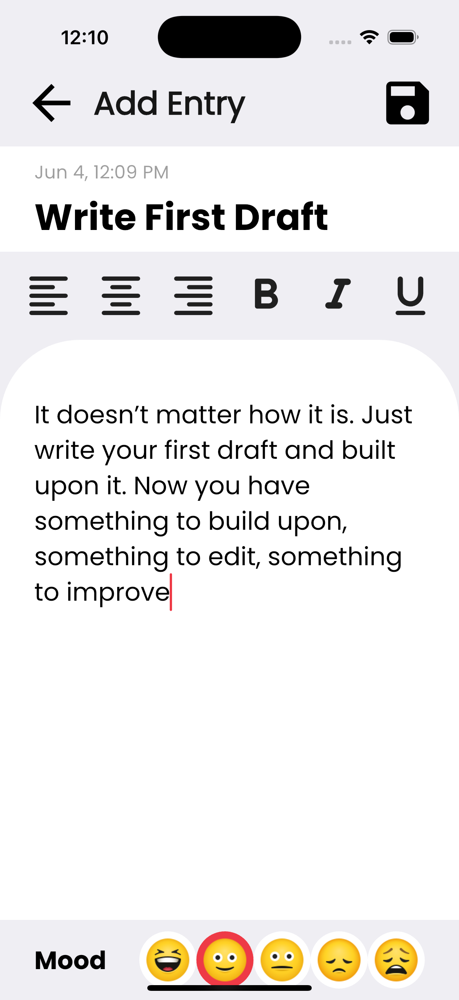

# 📝 My Notes App

A clean, simple, and intuitive Flutter-based Notes App that lets you write, edit, and manage your daily thoughts, tasks, and moods — all stored locally using SQLite.

## 📲 Download Now

The app is live on the Google Play Store!  
👉 [Download from Google Play](https://play.google.com/store/apps/details?id=com.beautifulminds.my_notes)

📸 Screenshots

🌞 Light Mode Screenshots

  
  
  
  
  
  

🌚 Dark Mode Screenshots

  
  
  
  
  
  

## 💡 Features

- ✍️ Create, edit, and delete notes
- 😊 Mood selection (Happy, Sad, Neutral, etc.)
- 📅 Auto-saves last edited date and time
- 📱 Beautiful and minimal UI
- 📦 Offline-first with SQLite local storage
- 🧱 Built with Flutter and used stacked package for state management
- 🔓 PIN setup for privacy

## 🚀 Tech Stack

- **Flutter** – UI development  
- **SQLite (sqflite)** – Local storage  
- **Stacked (provider based) state-management**  
- **get_it** – Dependency Injection  
- **Dart** – Programming language

📜 License
This project is licensed under the MIT License.

Made with ❤️ in Flutter